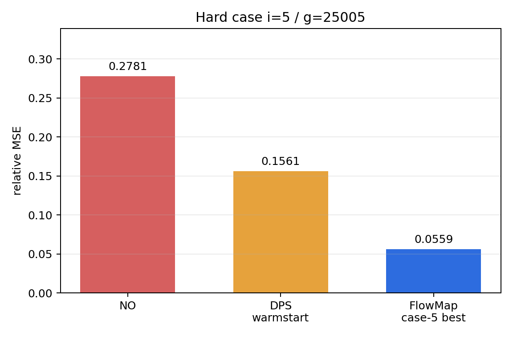
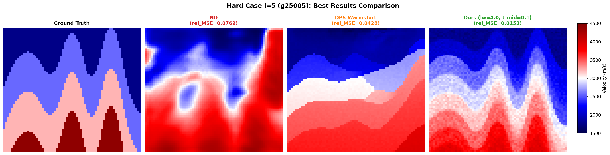
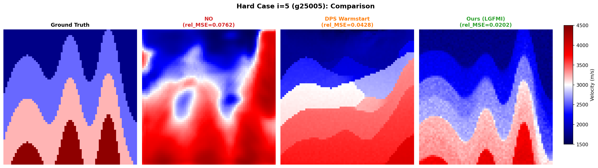

# Flow Map in Full Waveform Inversion

This repository is a compact case study for using an unconditional FlowMap prior in a full waveform inversion (FWI) inverse problem.

The repository now focuses on one hard diagnostic example:

```text
case i = 5
global index = 25005
```

This case is useful because it separates visual/geological correctness from low seismic misfit: several inverse solvers can reduce waveform loss while still selecting a poor velocity basin.

## Main Idea

The method is intentionally simple:

```text
raw-noise FlowMap proposal bank
+ focused / multiscale seismic ranking
+ clean-space local linearized MAP / SGD correction
```

There is:

- no Neural Operator initialization,
- no learned inverse corrector,
- no posterior network trained on `y`.

The learned FlowMap is used only as an unconditional prior. The measurement enters only through the FWI forward model / seismic scoring and local correction.

## Case-5 Result

Best case-5 run:

```text
lw4_tmid01_s20264500
MSE = 0.0559
```

Visible baselines on the same case:

| Method | Case-5 MSE | Notes |
|---|---:|---|
| NO baseline | 0.2781 | Neural Operator style baseline output |
| DPS / DDPM best visible | 0.1561 | best visible method: warmstart |
| FlowMap inverse, case-5 search | **0.0559** | raw-noise proposal bank + local correction |



Main visual comparison:



Original comparison figure:



## What Is Compared?

### FlowMap inverse

The case-5 search used variants of:

- focused or global seismic scoring,
- different `t_mid` values,
- different `late_weight` values,
- raw-noise proposal banks.

The best case-5 setting was:

```text
late_weight = 4.0
t_mid       = 0.1
seed        = 20264500
```

The full evaluation script copied from the pod is:

```text
src/eval_ms_v113.py
```

The exact full-32 stable run was not kept as the main README result, because this repository is now case-5 only. The full-run code is still useful as the implementation source for the FlowMap inverse machinery.

### DPS / DDPM

The DPS/DDPM diagnostic baseline is:

```text
src/dps_v3.py
scripts/run_dps_hard.sh
```

For case 5, the visible methods in `dps_hard_restart2.log` gave:

| DPS variant | Case-5 MSE |
|---|---:|
| vanilla_z01 | 0.4388 |
| vanilla_z05 | 0.3484 |
| warmstart | **0.1561** |
| annealed | 0.4901 |
| PSD | 0.3591 |
| TMPD | 0.3306 |
| PS+ | 0.3330 |
| MCG | 0.4266 |

### NO and UNet are separate baselines

`NO` and `UNet` are not the same baseline.

The `NO` result here is the Neural Operator style baseline used inside the FWI evaluation logs as `no_mse`. It is a baseline prediction and is **not** used to initialize the FlowMap inverse method.

The UNet / PINN-UNet baselines are separate supervised amortized inverse maps. Their training entry point is:

```text
src/run_operator_fwi.py
```

Variants:

```text
--variant unet
--variant pinn_unet
--variant fno
```

The current retraining jobs were launched separately after this snapshot:

```text
unet      -> /workspace/fmm_outputs/operator_retrain_cva_0601/unet
pinn_unet -> /workspace/fmm_outputs/operator_retrain_cva_0601/pinn_unet
```

These are not yet folded into the case-5 README result.

## Data Generation Code

FWI data generation / forward modeling code is included under `src/`:

```text
src/data_gen_f_cva.py       # CVA FWM/data-generation operator copied from the pod
src/gen_fwi_obs.py          # local observation generation helper
src/gen_fwi_obs_multi.py    # multi-case observation generation helper
```

The cache format expected by the experiments is:

```text
vel_*.pt
seis_*.pt
```

## Repository Contents

```text
figures/
  case5_best_compare.png
  case5_best_compare_v2.png
  case5_mse_bar.png

results/
  case5_curated_results.json
  case5_search_summary.json
  case5_search.log
  dps_hard_restart2.log

src/
  eval_ms_v113.py
  dps_v3.py
  run_operator_fwi.py
  run_ddim_dps_fwi.py
  run_ddpm_baselines_fwi.py
  data_gen_f_cva.py
  gen_fwi_obs.py
  gen_fwi_obs_multi.py

scripts/
  run_v113.sh
  run_dps_hard.sh
```

## Reproduce the Case-5 Summary Figure

```bash
pip install -r requirements.txt
python - <<'PY'
import json, pathlib
import matplotlib.pyplot as plt

root = pathlib.Path('.')
res = json.loads((root / 'results/case5_curated_results.json').read_text())
labels = ['NO', 'DPS warmstart', 'FlowMap']
vals = [res['no_mse_from_dps_log'], res['dps_best_visible']['mse'], res['main_best']['mse']]
plt.bar(labels, vals)
plt.ylabel('relative MSE')
plt.title('Hard case i=5 / g=25005')
plt.tight_layout()
plt.savefig('figures/case5_mse_bar.png', dpi=180)
PY
```

## References

- Boffi, N. M., et al. *Flow Map Matching*. arXiv, 2024.
- Chung, H., Sim, B., Ryu, D., and Ye, J. C. *Improving Diffusion Models for Inverse Problems using Manifold Constraints*. NeurIPS, 2022.
- Song, Y., Sohl-Dickstein, J., Kingma, D. P., Kumar, A., Ermon, S., and Poole, B. *Score-Based Generative Modeling through Stochastic Differential Equations*. ICLR, 2021.
- Li, Z., Kovachki, N., Azizzadenesheli, K., et al. *Fourier Neural Operator for Parametric Partial Differential Equations*. ICLR, 2021.
- Virieux, J. and Operto, S. *An overview of full-waveform inversion in exploration geophysics*. Geophysics, 2009.
- NVIDIA Modulus / PhysicsNeMo documentation and examples for neural-operator and physics-informed operator learning baselines.

## Short Takeaway

For this hard FWI case, deterministic or diffusion inverse solvers can be unstable because the seismic objective is multimodal. A raw-noise FlowMap proposal bank preserves multiple geological candidates long enough for focused multiscale scoring and local MAP correction to select a better basin.
