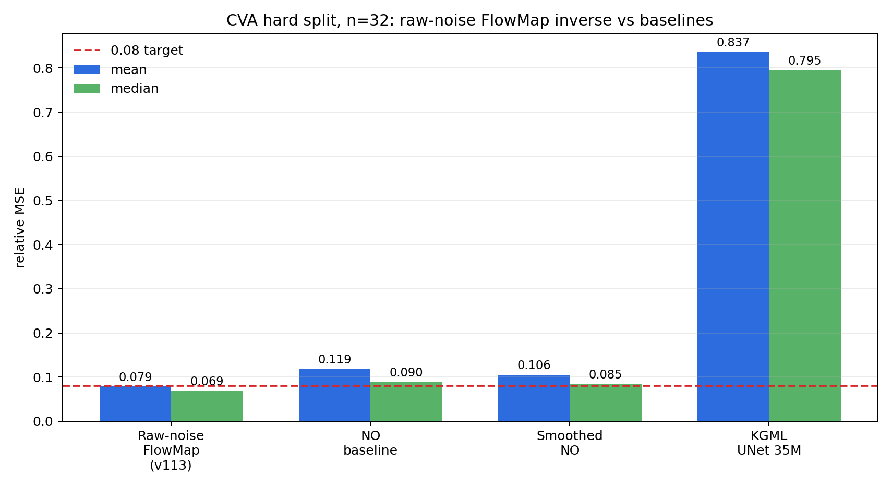
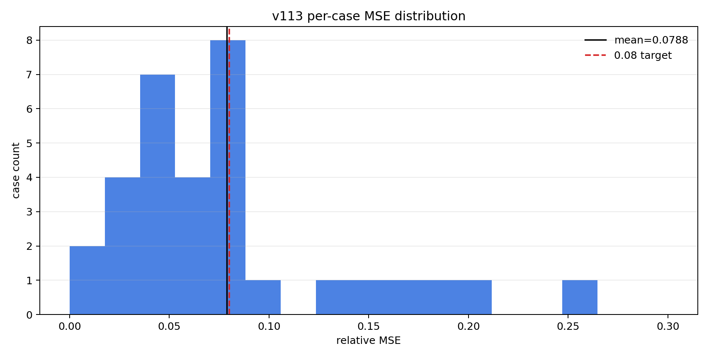
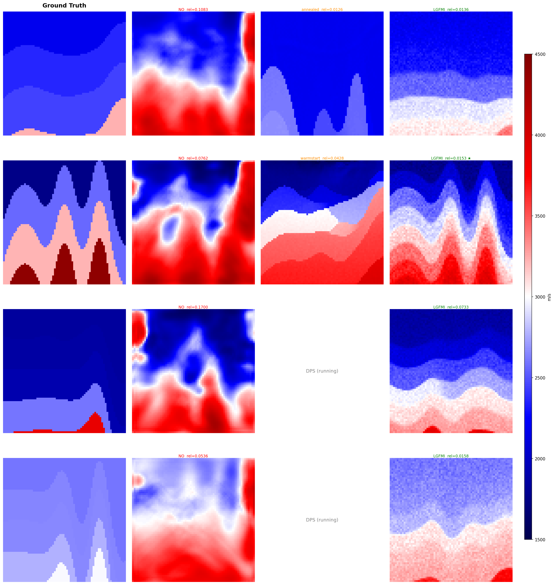

# Raw-Noise FlowMap Inversion for FWI

This repository is a compact research snapshot for **raw-noise FlowMap inverse modeling** on CVA-style full waveform inversion cases.

The main result here is deliberately minimal:

> sample a large bank of raw-noise FlowMap proposals, rank them with focused multiscale seismic misfit, then apply a small clean-space local linearized MAP / SGD correction.

There is **no NO initialization** and **no learned inverse corrector** in the main method. The neural models used are only the unconditional FlowMap prior and baseline predictors.

## Main Result

Best complete run:

`v113_full32_tmid01_lw2_s3`

| Method | n | Mean MSE | Median MSE | Min | Max | Cases < 0.08 |
|---|---:|---:|---:|---:|---:|---:|
| Raw-noise FlowMap inverse, v113 | 32 | **0.0788** | 0.0690 | 0.0118 | 0.2554 | 20 |
| Neural Operator baseline, `NO` | 32 | 0.1194 | 0.0895 | 0.0193 | 0.3569 | 14 |
| Smoothed NO baseline | 32 | 0.1056 | 0.0852 | 0.0182 | 0.3295 | 15 |
| KGML UNet 35M baseline | 32 | 0.8369 | 0.7951 | 0.1964 | 1.9599 | 0 |





## Qualitative Hard-Case Figures

Hard case `i=5 / global_idx=25005` was used as a diagnostic case because it exposes a failure mode of both pure ranking and many DPS variants: the seismic misfit can be low while the geological layer correspondence is still wrong.

Original comparison:


Improved case-5 search figure:


Four hard cases:



## Algorithm

The main run uses `proposal_ms_lgfmi_grad`:

1. Draw raw-noise seeds.
2. Push each seed through the unconditional FlowMap prior.
3. Score proposals by focused multiscale seismic consistency.
4. Keep a proposal bank rather than committing to a single sample too early.
5. Apply clean-space local linearized MAP-style correction with a small SGD update.
6. Select by focused multiscale score.

Important settings from `v113`:

```text
--no_seeded_frac 0.0
--bg_mode zero
--method proposal_ms_lgfmi_grad
--ensemble 2048
--proposal_ms_scales 16,8,4,2,1
--proposal_ms_topk_start 512
--proposal_ms_union_k 512
--proposal_ms_union_views 16,8,4,2
--lgfmi_k 32
--lgfmi_t_mid 0.1
--late_weight 2.0
--lgfmi_grad_steps 8
--lgfmi_grad_lr 0.03
--lgfmi_grad_trust 0.05
--lgfmi_grad_sgd
```

The reproduction launcher is in [`scripts/run_v113.sh`](scripts/run_v113.sh).

## Baselines

### DPS / DDPM inverse baseline

Code:

- [`src/dps_v3.py`](src/dps_v3.py)
- [`scripts/run_dps_hard.sh`](scripts/run_dps_hard.sh)

Current hard-case status is partial. Completed / visible rows from `dps_hard_restart2.log`:

| Case | NO MSE | Best DPS method | Best DPS MSE | Note |
|---:|---:|---|---:|---|
| 0 | 0.2771 | MCG | 0.0415 | strong on this case |
| 5 | 0.2781 | warmstart | 0.1561 | much worse than case-5 FlowMap search |
| 7 | 0.3460 | vanilla_z05 | 0.0655 | partial log; later methods were still running/truncated |

Interpretation: DPS can solve some cases, but on these hard cases it is slow and unstable. Case 5 is the clearest miss: the best visible DPS result is `0.1561`, while the focused FlowMap search reached about `0.0559`.

### Neural Operator baseline, `NO`

This is the baseline reported in the `eval_ms` rows as `no_mse`. It is a **separate baseline from the KGML UNet 35M** below.

In the current workspace the checkpoint path is:

```text
/workspace/fmm_outputs/bench_cva_operator/unet/final.pt
```

The directory name is confusing, but in the logs and result rows this is the `NO` / neural-operator-style baseline. It is used only for comparison and is **not** used to initialize the main raw-noise FlowMap method. In `v113`, raw-noise FlowMap improves over this baseline:

```text
NO mean MSE:      0.1194
FlowMap v113:     0.0788
```

### KGML UNet 35M baseline

This is a different baseline from `NO`. The larger KGML UNet baseline **did run**:

```text
kgml_unet33m_cva_n32.json
kgml_unet33m_n32.log
```

Result:

```text
n=32
mean MSE = 0.8369
min MSE  = 0.1964
cases < 0.08 = 0/32
```

This is not competitive on this test split. It is included to document that the failure is not simply “train a bigger UNet.”

## Repository Contents

```text
src/
  eval_ms_v113.py              # exact eval script copied from the pod used for v113
  dps_v3.py                    # DPS/DDPM diagnostic baseline
  run_operator_fwi.py          # neural-operator baseline entry point
  run_ddim_dps_fwi.py          # older DPS runner
  run_ddpm_baselines_fwi.py    # older DDPM baseline runner

scripts/
  run_v113.sh                  # reproduction command for the best complete run
  run_dps_hard.sh              # hard-case DPS baseline launcher
  summarize_results.py         # parses logs and regenerates summary figures

results/
  prop_ms_lgfmi_sgd_v113_full32_tmid01_lw2_s3.log
  summary_curated.json
  dps_hard_restart2.log
  dps_hard_summary.json
  kgml_unet33m_cva_n32.json
  kgml_unet33m_n32.log

figures/
  results_summary.png
  v113_mse_histogram.png
  case5_best_compare.png
  case5_best_compare_v2.png
  hard4row_compare_white.png
```

## Regenerate Figures

```bash
pip install -r requirements.txt
python scripts/summarize_results.py
```

This refreshes:

- `results/summary_curated.json`
- `figures/results_summary.png`
- `figures/v113_mse_histogram.png`

## Takeaway

The strongest simple version so far is **not** a learned inverse corrector and not NO initialization. It is:

```text
raw-noise FlowMap proposal bank
+ focused/multiscale ranking
+ clean-space local linearized MAP / SGD correction
```

The current best complete setting is `t_mid=0.1, late_weight=2.0`. Larger late weights (`4` or `6`) often improve some cases but create worse outliers; `late_weight=2` is currently the most stable full-32 setting.
