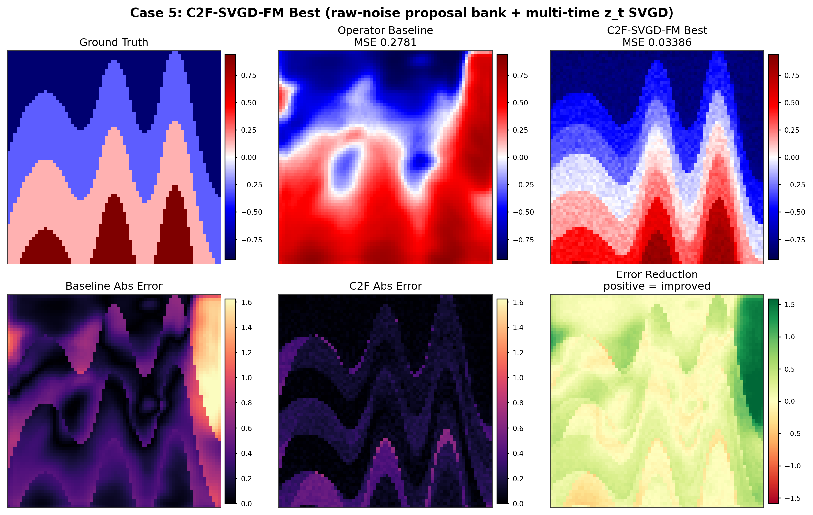
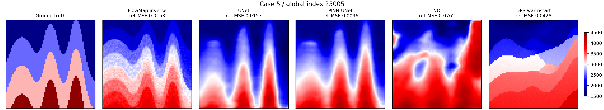

# Flow Map in Full Waveform Inversion

This repository is a compact case study for using an unconditional FlowMap prior in a full waveform inversion (FWI) inverse problem.

The repository focuses on one hard diagnostic example:

```text
case i = 5
global index = 25005
```

This case is useful because it separates visual/geological correctness from low seismic misfit. Several inverse solvers can reduce waveform loss while still selecting a poor velocity basin.

## Main Idea

The current main method is **C2F-SVGD-FM: Coarse-to-Fine SVGD FlowMap Assimilation**.

```text
raw-noise proposal bank
-> multiscale blind rank
-> multi-time z_t trajectory
-> FlowMap look-ahead
-> differentiable FWI forward H
-> SVGD / Adam particle update
-> tether / trust / gate
-> final blind select
```

The particles are not re-sampled independently at every time. The same selected particles move along a FlowMap trajectory:

```text
z_0.85 -> z_0.70 -> z_0.55 -> z_0.40 -> z_0.25 -> z_0.12
```

Large FlowMap times are used for coarse basin selection; late times are used for local refinement. The method uses only observation consistency through the differentiable FWI operator and multiscale seismic ranking.

There is:

- no Neural Operator initialization,
- no UNet initialization,
- no learned inverse corrector,
- no posterior network trained on the observed seismic data.

The learned FlowMap is used as an unconditional prior. The measurement enters through FWI forward modeling, multiscale scoring, and trajectory-compatible particle updates.

## Why FlowMap Instead of a Supervised Inverse Map?

UNet and PINN-UNet are supervised amortized inverse maps: they learn a direct map from seismic data to velocity fields over the training distribution. This is fast and strong, but for multimodal inverse problems it tends to behave like a conditional average. In hard FWI cases, that averaging can smooth or blur sharp discontinuous interfaces, especially when several geological basins explain similar seismic observations.

Diffusion DPS-type methods introduce a stronger generative prior, so they can represent sharper and more diverse structures. However, the usual DPS pipeline depends on a long reverse chain and repeatedly evaluates guidance through an estimated clean sample, often via Tweedie-style denoising estimates. In strongly nonconvex FWI, this can make the guidance noisy or biased across many steps, so the final model may still miss the correct basin.

C2F-SVGD-FM keeps the generative-prior advantage but makes the inverse update more targeted:

1. **Raw-noise proposal bank + multiscale blind rank** keeps many geological basin candidates and selects them using only seismic consistency.
2. **Trajectory-compatible multi-time `z_t` updates** guide the same particles from coarse FlowMap times to late refinement times instead of solving a one-shot correction.
3. **SVGD / Adam with tether, trust, and gate** uses differentiable FWI gradients while preserving particle diversity and rejecting harmful updates.

## Case-5 Result

Best case-5 C2F-SVGD-FM result:

```text
normalized MSE = 0.033861700
initialization = pure raw noise
selection = blind seismic score only
```

This is lower than the supervised UNet and PINN-UNet baselines on the same case.

| Method | Case-5 MSE | Notes |
|---|---:|---|
| NO baseline | 0.2781 | Neural Operator style baseline output |
| DPS / DDPM best visible | 0.1561 | best visible DPS variant: warmstart |
| UNet retrain | 0.0558 | supervised amortized inverse map, not used by C2F-SVGD-FM |
| PINN-UNet retrain | 0.0352 | supervised inverse map with physics loss, not used by C2F-SVGD-FM |
| C2F-SVGD-FM | **0.0339** | pure-noise FlowMap proposal bank + multi-time SVGD assimilation |



Historical operator comparison:



FlowMap / DPS / NO diagnostic comparison:


## C2F-SVGD-FM Details

### 1. Raw-noise proposal bank

The method starts from raw Gaussian noise and generates a large proposal bank with the unconditional FlowMap prior. Each proposal is decoded to a candidate clean velocity model and scored against the observed seismic data.

### 2. Multiscale blind rank

"Blind" means the ranking uses no ground-truth velocity model. It can use the observed seismic response:

```text
score_i = sum_l alpha_l || Q_l H(v_i) - Q_l y ||^2
```

where `Q_l` is a multiscale projection such as time pooling, frequency filtering, receiver smoothing, direct-wave mute, or late-time weighting.

### 3. Multi-time trajectory assimilation

The top proposals are moved through FlowMap time. At each time `t`, the current particle `z_t` is looked ahead to clean space:

```text
x0_hat = Phi_theta(z_t, t, 0)
v_hat  = to_raw(x0_hat)
y_hat  = H(v_hat)
```

The optimized variable is still `z_t`, not the raw velocity field.

### 4. SVGD / Adam update

The differentiable FWI forward model provides a posterior gradient:

```text
E_i = data_misfit_i + lambda_t || z_t_i - z_t_prior_i ||^2
g_i = - grad_z E_i
```

SVGD uses attraction toward observation-consistent particles plus kernel repulsion to preserve multiple basin hypotheses. Adam-style scaling is used for stable high-dimensional updates.

### 5. Tether / trust / gate

The tether and trust region keep particles compatible with the FlowMap trajectory. A gate rejects updates that do not improve the multiscale seismic score.

## Current Reproduction Entry Point

The current C2F-SVGD-FM implementation is:

```text
src/c2f_svgd_fm_case5.py
scripts/run_flowmap_case5.sh
```

The public run script uses the case-5 configuration summarized above. Paths may need adjustment for a different cluster layout.

## DPS / DDPM Baselines

The DPS/DDPM diagnostic baseline is:

```text
src/dps_v3.py
scripts/run_dps_hard.sh
```

For case 5, visible methods in `dps_hard_restart2.log` gave:

| DPS variant | Case-5 MSE |
|---|---:|
| vanilla_z01 | 0.4388 |
| vanilla_z05 | 0.3484 |
| warmstart | **0.1561** |
| annealed | 0.4901 |
| PSD | 0.3591 |
| TMPD | 0.3306 |
| PS+ | 0.3330 |
| MCG | 0.4266 |

## NO, UNet, and PINN-UNet

`NO`, `UNet`, and `PINN-UNet` are separate baselines.

The `NO` result is the Neural Operator style baseline used inside the FWI evaluation logs as `no_mse`. It is not used to initialize C2F-SVGD-FM.

The UNet / PINN-UNet baselines are supervised amortized inverse maps. Their training entry point is:

```text
src/run_operator_fwi.py
```

Variants:

```text
--variant unet
--variant pinn_unet
--variant fno
```

The operator retraining jobs on the same CVA cache gave:

```text
UNet      normalized MSE = 0.0558
PINN-UNet normalized MSE = 0.0352
```

C2F-SVGD-FM does not use either baseline as initialization or as a learned corrector.

## Data Generation Code

FWI data generation / forward modeling code is included under `src/`:

```text
src/data_gen_f_cva.py       # CVA FWM/data-generation operator copied from the pod
src/gen_fwi_obs.py          # local observation generation helper
src/gen_fwi_obs_multi.py    # multi-case observation generation helper
```

The cache format expected by the experiments is:

```text
vel_*.pt
seis_*.pt
```

## Repository Contents

```text
figures/
  case5_c2f_svgd_best_033861_compare.png
  case5_best_compare.png
  case5_best_compare_v2.png
  case5_with_operator_baselines.png
  case5_mse_bar.png

results/
  case5_curated_results.json
  case5_operator_metrics.json
  case5_search_summary.json
  case5_search.log
  dps_hard_restart2.log

src/
  c2f_svgd_fm_case5.py
  flowmap_inverse_case5.py
  dps_v3.py
  run_operator_fwi.py
  run_ddim_dps_fwi.py
  run_ddpm_baselines_fwi.py
  data_gen_f_cva.py
  gen_fwi_obs.py
  gen_fwi_obs_multi.py

scripts/
  run_flowmap_case5.sh
  run_dps_hard.sh
```

## Reproduce the Case-5 Summary Figure

```bash
pip install -r requirements.txt
python - <<'PY'
import json, pathlib
import matplotlib.pyplot as plt

root = pathlib.Path('.')
res = json.loads((root / 'results/case5_curated_results.json').read_text())
labels = ['NO', 'DPS', 'UNet', 'PINN-UNet', 'C2F-SVGD-FM']
vals = [
    res['no_mse_from_dps_log'],
    res['dps_best_visible']['mse'],
    res['unet_retrain_mse'],
    res['pinn_unet_retrain_mse'],
    res['main_best']['mse'],
]
plt.figure(figsize=(7, 3.5))
plt.bar(labels, vals)
plt.ylabel('normalized MSE')
plt.title('Hard case i=5 / g=25005')
plt.xticks(rotation=20, ha='right')
plt.tight_layout()
plt.savefig('figures/case5_mse_bar.png', dpi=180)
PY
```

## References

- Boffi, N. M., et al. *Flow Map Matching*. arXiv, 2024.
- Chung, H., Sim, B., Ryu, D., and Ye, J. C. *Improving Diffusion Models for Inverse Problems using Manifold Constraints*. NeurIPS, 2022.
- Song, Y., Sohl-Dickstein, J., Kingma, D. P., Kumar, A., Ermon, S., and Poole, B. *Score-Based Generative Modeling through Stochastic Differential Equations*. ICLR, 2021.
- Liu, Q. and Wang, D. *Stein Variational Gradient Descent: A General Purpose Bayesian Inference Algorithm*. NeurIPS, 2016.
- Li, Z., Kovachki, N., Azizzadenesheli, K., et al. *Fourier Neural Operator for Parametric Partial Differential Equations*. ICLR, 2021.
- Virieux, J. and Operto, S. *An overview of full-waveform inversion in exploration geophysics*. Geophysics, 2009.
- NVIDIA Modulus / PhysicsNeMo documentation and examples for neural-operator and physics-informed operator learning baselines.

## Short Takeaway

For this hard FWI case, single-shot inverse solvers can be unstable because the seismic objective is multimodal. C2F-SVGD-FM keeps multiple raw-noise FlowMap basin candidates alive, transports them through FlowMap time, and uses differentiable FWI guidance plus gated SVGD updates to select a better geological basin.
