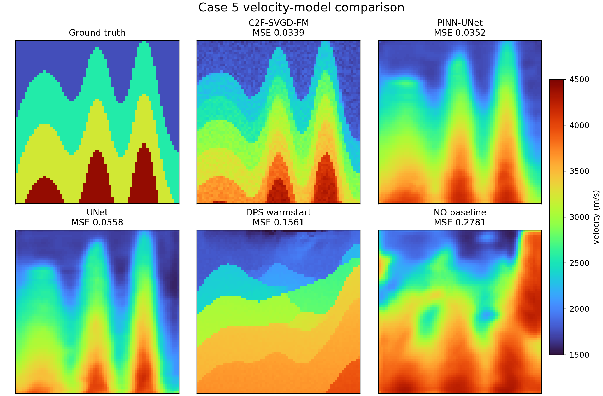
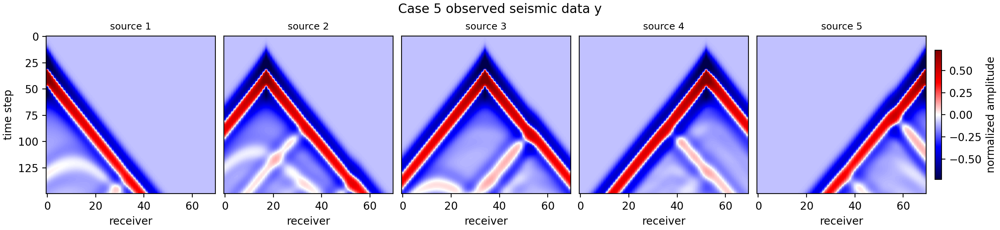

# Flow Map in Full Waveform Inversion

This repository is a compact case study for using an unconditional FlowMap prior in a full waveform inversion (FWI) inverse problem.

The study focuses on one hard diagnostic example:

```text
case i = 5
global index = 25005
```

This case is useful because it separates geological correctness from low seismic misfit. Several inverse solvers can reduce waveform loss while still selecting a poor velocity basin.

## Main Idea

The main method is **C2F-SVGD-FM: Coarse-to-Fine SVGD FlowMap Assimilation**.

```text
raw-noise proposal bank
-> multiscale blind rank
-> trajectory-compatible FlowMap particles
-> differentiable FWI guidance
-> SVGD / Adam update
-> tether / trust / gate
-> final blind select
```

The learned FlowMap is used as an unconditional prior. The measurement enters only through FWI forward modeling, multiscale seismic scoring, and particle updates. The method does not use Neural Operator or UNet initialization, and it does not train a learned inverse corrector on the observed data.

## Motivation

UNet and PINN-UNet are supervised amortized inverse maps. They learn a direct map from seismic data to velocity fields over the training distribution. This is fast and strong, but in multimodal inverse problems such maps often behave like conditional averages. For hard FWI cases, that averaging can blur sharp discontinuous interfaces or collapse multiple plausible geological basins into a smooth output.

Diffusion DPS-type methods bring a stronger generative prior and can represent sharper structures. However, standard DPS uses many reverse steps and repeatedly guides through an estimated clean sample, often via Tweedie-style denoising estimates. In strongly nonconvex FWI, the repeated guidance can be noisy or biased, so the sampler may still miss the correct basin.

C2F-SVGD-FM keeps the generative-prior advantage while making the inverse update more targeted:

1. **Proposal diversity:** start from a raw-noise FlowMap proposal bank and keep multiple basin candidates.
2. **Coarse-to-fine seismic ranking:** use multiscale observation consistency, not ground-truth velocity, to choose useful particles.
3. **Particle transport in FlowMap time:** move the same particles along the FlowMap trajectory and update them with differentiable FWI gradients, SVGD diversity, and conservative accept/reject gates.

## Case-5 Result

Best case-5 C2F-SVGD-FM result:

```text
normalized MSE = 0.033861700
initialization = pure raw noise
selection = blind seismic score only
```

This is lower than the supervised UNet and PINN-UNet baselines on the same case.

| Method | Case-5 MSE | Notes |
|---|---:|---|
| NO baseline | 0.2781 | Neural Operator style baseline output |
| DPS / DDPM best visible | 0.1561 | best visible DPS diagnostic baseline |
| UNet retrain | 0.0558 | supervised amortized inverse map |
| PINN-UNet retrain | 0.0352 | supervised inverse map with physics loss |
| C2F-SVGD-FM | **0.0339** | pure-noise FlowMap proposal bank + multi-time SVGD assimilation |

## Figures

All velocity-model comparisons:



Observed seismic data for this case, i.e. the measured `y` used by the inverse problem:



## Code

Main C2F-SVGD-FM entry point:

```text
src/c2f_svgd_fm_case5.py
scripts/run_flowmap_case5.sh
```

Baseline and data-generation code:

```text
src/dps_v3.py
src/run_operator_fwi.py
src/data_gen_f_cva.py
src/gen_fwi_obs.py
src/gen_fwi_obs_multi.py
```

## Repository Contents

```text
figures/
  case5_all_comparisons.png
  case5_observed_y.png

results/
  case5_curated_results.json
  case5_operator_metrics.json
  case5_search_summary.json
  case5_observed_y.npy
  case5_search.log
  dps_hard_restart2.log

src/
  c2f_svgd_fm_case5.py
  flowmap_inverse_case5.py
  dps_v3.py
  run_operator_fwi.py
  run_ddim_dps_fwi.py
  run_ddpm_baselines_fwi.py
  data_gen_f_cva.py
  gen_fwi_obs.py
  gen_fwi_obs_multi.py

scripts/
  run_flowmap_case5.sh
  run_dps_hard.sh
```

## References

- Boffi, N. M., et al. *Flow Map Matching*. arXiv, 2024.
- Chung, H., Sim, B., Ryu, D., and Ye, J. C. *Improving Diffusion Models for Inverse Problems using Manifold Constraints*. NeurIPS, 2022.
- Song, Y., Sohl-Dickstein, J., Kingma, D. P., Kumar, A., Ermon, S., and Poole, B. *Score-Based Generative Modeling through Stochastic Differential Equations*. ICLR, 2021.
- Liu, Q. and Wang, D. *Stein Variational Gradient Descent: A General Purpose Bayesian Inference Algorithm*. NeurIPS, 2016.
- Li, Z., Kovachki, N., Azizzadenesheli, K., et al. *Fourier Neural Operator for Parametric Partial Differential Equations*. ICLR, 2021.
- Virieux, J. and Operto, S. *An overview of full-waveform inversion in exploration geophysics*. Geophysics, 2009.
- NVIDIA Modulus / PhysicsNeMo documentation and examples for neural-operator and physics-informed operator learning baselines.

## Short Takeaway

For this hard FWI case, single-shot inverse solvers can be unstable because the seismic objective is multimodal. C2F-SVGD-FM keeps multiple raw-noise FlowMap basin candidates alive, transports them through FlowMap time, and uses differentiable FWI guidance plus gated SVGD updates to select a better geological basin.
